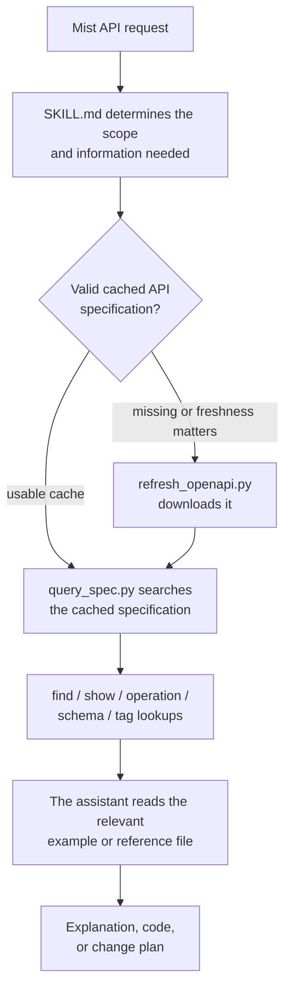

# Unofficial API Integration Skill for Juniper Mist

> Grounds an AI coding assistant's Juniper Mist API work in the official OpenAPI specification and tested, safety-first example scripts.

**TL;DR:** Install this repository as the `mist-api` skill for an Agent Skills-compatible assistant, run `python scripts/refresh_openapi.py` once to download Juniper's API reference into a local cache, then ask for Mist API explanations, scripts, or change plans. The assistant verifies endpoints before writing code, and live changes require explicit confirmation.

This project is independent and is not affiliated with, endorsed by, or sponsored by Juniper Networks or Hewlett Packard Enterprise (HPE).

- [How the skill works](#how-the-skill-works)
  - [When each support script is engaged](#when-each-support-script-is-engaged)
  - [When the example scripts are engaged](#when-the-example-scripts-are-engaged)
- [Before first use](#before-first-use)
  - [Install the skill](#install-the-skill)
  - [Environment variables](#environment-variables)
  - [Download the API reference manual](#download-the-api-reference-manual)
- [Safety rules built into the skill](#safety-rules-built-into-the-skill)
- [Folder map](#folder-map)
- [Maintainer checks](#maintainer-checks)
- [License](#license)

## How the skill works

`SKILL.md` controls the workflow. When a Mist task requires exact endpoint, field, authentication, or pagination details, the assistant engages the supporting scripts in this order:



The scripts under `scripts/` inspect API documentation only. They do not connect to a Mist tenant or change its configuration.

### When each support script is engaged

#### `scripts/refresh_openapi.py`

This script manages the local copy of Juniper's Mist OpenAPI specification.

- `python scripts/refresh_openapi.py --offline` is engaged first. It verifies that a usable cached specification exists without using the network or writing files.
- `python scripts/refresh_openapi.py` is engaged when no valid cache exists or when current API details are important. It downloads the specification from Juniper, validates it, and safely replaces the cached copy.
- If a download fails, the existing valid cache remains in place.

#### `scripts/spec_cache.py`

This is a shared internal helper. A user normally does not run it directly.

It is automatically imported by both `refresh_openapi.py` and `query_spec.py` to:

- Choose the cache location for the operating system.
- Honor an explicit file path or the `MIST_OPENAPI_PATH` environment variable.
- Prevent the downloaded specification from being stored inside the installed skill.
- Enforce the file-size limit and validate that the file is a Mist OpenAPI 3.x document.

#### `scripts/query_spec.py`

This script is engaged after a valid specification is available. It retrieves a small, relevant section instead of loading the entire document.

The usual command flow is:

1. `info` confirms the specification version, available servers, and authentication schemes.
2. `find TERM` searches for possible endpoints when the exact path is unknown.
3. `show METHOD PATH` displays a concise view of one endpoint: parameters, security, request body, and responses. Parameter lines name the data model and print the allowed `enum[...]` or `const=` values; request and response schemas are named even inside composed models and arrays.
4. `operation METHOD PATH` is used when expanded request or response schemas are needed.
5. `schema NAME` is used to inspect a reusable data model. Add `--property FIELD` when only one field is needed; the name printed by `show` is the usual argument. Composed models are merged into one answer when possible, and otherwise reported per variant.
6. `tags` or `tag NAME` is used to browse groups of related endpoints.

Example:

```bash
python scripts/refresh_openapi.py --offline
python scripts/query_spec.py find wlans
python scripts/query_spec.py show GET "/api/v1/orgs/{org_id}/wlans"
python scripts/query_spec.py operation GET "/api/v1/orgs/{org_id}/wlans" --max-depth 1
python scripts/query_spec.py schema wlan --property ssid --max-depth 1
```

Output is deliberately bounded with `--limit`, `--max-depth`, and `--max-chars`. This keeps searches focused and prevents the full API specification from being placed into the assistant's context. Oversized results are trimmed in stages while staying valid and keeping the root schema visible. [references/openapi.md](references/openapi.md) describes the exact label formats, the trim order, and the `schema --property` JSON for composed models.

### When the example scripts are engaged

The assistant reads the closest matching example before creating REST code. These examples connect to a Mist tenant only when a user deliberately runs them with the required credentials and arguments.

- `examples/mist_client.py` is the shared API client used by the REST examples. It handles token attachment, approved HTTPS hosts, timeouts, bounded retries, pagination, and safe errors. It is imported by other examples rather than normally run by itself. Request bodies may be JSON objects or arrays; other value types are rejected before any request is sent. Details are in [references/implementation-patterns.md](references/implementation-patterns.md).
- `examples/list_sites.py` is used as the starting pattern for listing every site in an organization.
- `examples/get_site_devices_to_csv.py` is used for resolving a site and exporting its device statistics to CSV.
- `examples/update_wlan_stub.py` is used for previewing, applying, verifying, or rolling back one WLAN SSID change. It remains read-only unless `--apply` and the matching confirmation target are supplied, verifies uncertain outcomes without retrying the write, and keeps uncertain-recovery information separate from confirmed rollback. The file format and failure cases are in [references/safety-and-troubleshooting.md](references/safety-and-troubleshooting.md).
- `examples/webhook_receiver.py` is used when testing inbound Mist webhook delivery and signature validation on a local machine.

Reference files are loaded only when their topic applies: implementation patterns for REST code, safety guidance for writes, event integration guidance for webhooks or WebSockets, and Terraform guidance for declarative workflows.

## Before first use

You need an Agent Skills-compatible coding assistant and Python 3.10 or newer. The REST examples also use the Python `requests` package.

Install the example requirements:

```bash
python -m pip install -r examples/requirements.txt
```

Commands in this README use `python`. If that command is unavailable, try `python3` or `py -3`.

### Install the skill

Copy or clone this directory as `mist-api` inside the skills folder used by your assistant. For a personal Claude Code skill:

```bash
mkdir -p ~/.claude/skills/mist-api
git -C mist-api archive HEAD | tar -x -C ~/.claude/skills/mist-api
```

For a project-only Claude Code skill, use `.claude/skills/mist-api`. Other Agent Skills-compatible assistants use their corresponding skill directory.

Share a tagged GitHub source archive or `git archive HEAD`, not a copy of a used
working folder. Archives include tracked files only; review them before sharing.
Do not include `.env`, virtual environments, downloaded caches, CSV exports,
Terraform state, or rollback/pending recovery records.

### Environment variables

Use an isolated environment (`python -m venv .venv`) for dependencies. Activate it
using your platform's Python instructions before installing requirements.

| Variable | Used by | Meaning |
| --- | --- | --- |
| `MIST_API_TOKEN` | REST examples | Required secret API token; never paste it into chat or commit it |
| `MIST_BASE_URL` | REST examples | Optional official regional HTTPS origin ending in `/api/v1` |
| `ORG_ID` | Site listing / CSV export | Organization identifier |
| `TARGET_SITE_NAME`, `OUTPUT_CSV` | CSV export | Site lookup name and optional output path |
| `SITE_ID`, `WLAN_ID` | WLAN example | Explicit target identifiers |
| `WEBHOOK_SHARED_SECRET` | Webhook receiver | Required webhook HMAC secret |
| `PORT`, `MAX_CONTENT_LENGTH_BYTES` | Webhook receiver | Optional listen port and body-size limit |
| `MIST_OPENAPI_PATH` | Documentation tools | Optional absolute cache path outside the installation |

The webhook example is not a production service: connection admission, inactivity
timeouts, and total connection deadlines limit resource use but do not provide TLS,
durable processing, replay protection, or production rate limiting.

### Download the API reference manual

The large Juniper OpenAPI specification is not included in this project. Download it into your local user cache:

```bash
python scripts/refresh_openapi.py
```

This downloads API documentation only; it does not configure your Mist tenant.

Later, you can check which cached version is available without downloading or changing anything:

```bash
python scripts/refresh_openapi.py --offline
```

Automation and test environments can choose a different cache file with `MIST_OPENAPI_PATH`. Use of downloaded Juniper material is subject to Juniper's applicable terms; see [NOTICE](NOTICE).

## Safety rules built into the skill

- API tokens should come from environment variables, never hardcoded files or chat output.
- Read-only discovery comes before configuration changes.
- Exact endpoints and fields are verified instead of guessed.
- Large result sets use pagination so records are not silently missed.
- Requests use timeouts and limited retries instead of retrying forever.
- Writes use the smallest necessary payload and a clearly bounded target list.
- Current state is checked again before a change to reduce the chance of overwriting someone else's work.
- Live writes and deletes require explicit, last-minute confirmation.
- The result is read back and compared with the requested outcome.

## Folder map

```text
mist-api/
  SKILL.md                 Main instructions and workflow for the assistant
  CHANGELOG.md             User-facing documentation revisions
  agents/openai.yaml       Skill information for compatible assistants
  scripts/                 OpenAPI download and lookup utilities
  references/              Detailed procedures and troubleshooting notes
  examples/                Reusable Python examples
  tests/                   Automated checks for this project
  LICENSE
  NOTICE
```

## Maintainer checks

These commands are for developers maintaining this skill; a normal user does not need to run them.

```bash
python -m pip install -r requirements-dev.txt
python -m pytest -q
ruff check .
ruff format --check .
bandit -q -r scripts examples
pip-audit -r requirements-dev.txt
python tools/check_secrets.py
python path/to/skill-creator/scripts/quick_validate.py .
```

The final validation command depends on where the Agent Skills validation utility is installed.

`ruff check` uses the rule set pinned in `ruff.toml` (`E4`, `E7`, `E9`, `F`, and `B`). A local run from this directory matches CI as Ruff's default rules change. No extra install step is required.

User-facing documentation changes are listed in [CHANGELOG.md](CHANGELOG.md).

## License

Authored project files are available under the [MIT License](LICENSE). Juniper content is not included under that license.

See [CONTRIBUTING.md](CONTRIBUTING.md) for changes and [SECURITY.md](SECURITY.md)
for private vulnerability reporting.

The project license does not grant rights to vendor documentation, trademarks,
logos, API services, or tenant data. Do not bundle downloaded specifications or
vendor manuals in forks, releases, or shared working folders. See [NOTICE](NOTICE)
for the vendor-material boundary and applicable legal-notice links.
